第二周：神经网络的编程基础(Basics of Neural Network programming)
--------------------------------------------------------------------
[TOC]
### 2.1 二分类(Binary Classification)

这周我们将学习神经网络的基础知识，其中需要注意的是，当实现一个神经网络的时候，我们需要知道一些非常重要的技术和技巧。例如有一个包含$m$个样本的训练集，你很可能习惯于用一个**for**循环来遍历训练集中的每个样本，但是当实现一个神经网络的时候，我们通常不直接使用**for**循环来遍历整个训练集，所以在这周的课程中你将学会如何处理训练集。

另外在神经网络的计算中，通常先有一个叫做前向暂停(**forward pause**)或叫做前向传播(**foward propagation**)的步骤，接着有一个叫做反向暂停(**backward pause**) 或叫做反向传播**(backward propagation**)的步骤。所以这周我也会向你介绍为什么神经网络的训练过程可以分为前向传播和反向传播两个独立的部分。

在课程中我将使用逻辑回归(l**ogistic regression**)来传达这些想法，以使大家能够更加容易地理解这些概念。即使你之前了解过逻辑回归，我认为这里还是有些新的、有趣的东西等着你去发现和了解，所以现在开始进入正题。

逻辑回归是一个用于二分类(**binary classification**)的算法。首先我们从一个问题开始说起，这里有一个二分类问题的例子，假如你有一张图片作为输入，比如这只猫，如果识别这张图片为猫，则输出标签1作为结果；如果识别出不是猫，那么输出标签0作为结果。现在我们可以用字母 $y$来 表示输出的结果标签，如下图所示：


我们来看看一张图片在计算机中是如何表示的，为了保存一张图片，需要保存三个矩阵，它们分别对应图片中的红、绿、蓝三种颜色通道，如果你的图片大小为64x64像素，那么你就有三个规模为64x64的矩阵，分别对应图片中红、绿、蓝三种像素的强度值。为了便于表示，这里我画了三个很小的矩阵，注意它们的规模为5x4 而不是64x64，如下图所示：

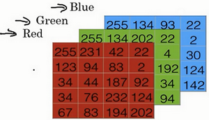

为了把这些像素值放到一个特征向量中，我们需要把这些像素值提取出来，然后放入一个特征向量$x$。为了把这些像素值转换为特征向量 $x$，我们需要像下面这样定义一个特征向量 $x$ 来表示这张图片，我们把所有的像素都取出来，例如255、231等等，直到取完所有的红色像素，接着最后是255、134、…、255、134等等，直到得到一个特征向量，把图片中所有的红、绿、蓝像素值都列出来。如果图片的大小为64x64像素，那么向量 $x$ 的总维度，将是64乘以64乘以3，这是三个像素矩阵中像素的总量。在这个例子中结果为12,288。现在我们用$n_x=12,288$，来表示输入特征向量的维度，有时候为了简洁，我会直接用小写的$n$来表示输入特征向量$x$的维度。所以在二分类问题中，我们的目标就是习得一个分类器，它以图片的特征向量作为输入，然后预测输出结果$y$为1还是0，也就是预测图片中是否有猫：


接下来我们说明一些在余下课程中，需要用到的一些符号。

**符号定义** ：

$x$：表示一个$n_x$维数据，为输入数据，维度为$(n_x,1)$； 

$y​$：表示输出结果，取值为$(0,1)​$；

$(x^{(i)},y^{(i)})$：表示第$i$组数据，可能是训练数据，也可能是测试数据，此处默认为训练数据； 

$X=[x^{(1)},x^{(2)},...,x^{(m)}]$：表示所有的训练数据集的输入值，放在一个 $n_x×m$的矩阵中，其中$m$表示样本数目; 

$Y=[y^{(1)},y^{(2)},...,y^{(m)}]$：对应表示所有训练数据集的输出值，维度为$1×m$。

用一对$(x,y)$来表示一个单独的样本，$x$代表$n_x$维的特征向量，$y$ 表示标签(输出结果)只能为0或1。
而训练集将由$m$个训练样本组成，其中$(x^{(1)},y^{(1)})$表示第一个样本的输入和输出，$(x^{(2)},y^{(2)})$表示第二个样本的输入和输出，直到最后一个样本$(x^{(m)},y^{(m)})$，然后所有的这些一起表示整个训练集。有时候为了强调这是训练样本的个数，会写作$M_{train}$，当涉及到测试集的时候，我们会使用$M_{test}$来表示测试集的样本数，所以这是测试集的样本数：


最后为了能把训练集表示得更紧凑一点，我们会定义一个矩阵用大写$X$的表示，它由输入向量$x^{(1)}$、$x^{(2)}$等组成，如下图放在矩阵的列中，所以现在我们把$x^{(1)}$作为第一列放在矩阵中，$x^{(2)}$作为第二列，$x^{(m)}$放到第$m$列，然后我们就得到了训练集矩阵$X$。所以这个矩阵有$m$列，$m$是训练集的样本数量，然后这个矩阵的高度记为$n_x$，注意有时候可能因为其他某些原因，矩阵$X$会由训练样本按照行堆叠起来而不是列，如下图所示：$x^{(1)}$的转置直到$x^{(m)}$的转置，但是在实现神经网络的时候，使用左边的这种形式，会让整个实现的过程变得更加简单：


现在来简单温习一下:$X$是一个规模为$n_x$乘以$m$的矩阵，当你用**Python**实现的时候，你会看到`X.shape`，这是一条**Python**命令，用于显示矩阵的规模，即`X.shape`等于$(n_x,m)$，$X$是一个规模为$n_x$乘以$m$的矩阵。所以综上所述，这就是如何将训练样本（输入向量$X$的集合）表示为一个矩阵。

那么输出标签$y$呢？同样的道理，为了能更加容易地实现一个神经网络，将标签$y$放在列中将会使得后续计算非常方便，所以我们定义大写的$Y$等于${{y}^{\left( 1 \right)}},{{y}^{\left( m \right)}},...,{{y}^{\left( m \right)}}$，所以在这里是一个规模为1乘以$m$的矩阵，同样地使用**Python**将表示为`Y.shape`等于$(1,m)$，表示这是一个规模为1乘以$m$的矩阵。


当你在后面的课程中实现神经网络的时候，你会发现，一个好的符号约定能够将不同训练样本的数据很好地组织起来。而我所说的数据不仅包括 $x$ 或者 $y$ 还包括之后你会看到的其他的量。将不同的训练样本的数据提取出来，然后就像刚刚我们对 $x$ 或者 $y$ 所做的那样，将他们堆叠在矩阵的列中，形成我们之后会在逻辑回归和神经网络上要用到的符号表示。如果有时候你忘了这些符号的意思，比如什么是 $m$，或者什么是 $n$，或者忘了其他一些东西，我们也会在课程的网站上放上符号说明，然后你可以快速地查阅每个具体的符号代表什么意思，好了，我们接着到下一个视频，在下个视频中，我们将以逻辑回归作为开始。
备注：附录里也写了符号说明。


### 2.2 逻辑回归(Logistic Regression)

在这个视频中，我们会重温逻辑回归学习算法，该算法适用于二分类问题，本节将主要介绍逻辑回归的**Hypothesis Function**（假设函数）。

对于二元分类问题来讲，给定一个输入特征向量$X$，它可能对应一张图片，你想识别这张图片识别看它是否是一只猫或者不是一只猫的图片，你想要一个算法能够输出预测，你只能称之为$\hat{y}$，也就是你对实际值 $y$ 的估计。更正式地来说，你想让 $\hat{y}$ 表示 $y$ 等于1的一种可能性或者是机会，前提条件是给定了输入特征$X$。换句话来说，如果$X$是我们在上个视频看到的图片，你想让 $\hat{y}$ 来告诉你这是一只猫的图片的机率有多大。在之前的视频中所说的，$X$是一个$n_x$维的向量（相当于有$n_x$个特征的特征向量）。我们用$w$来表示逻辑回归的参数，这也是一个$n_x$维向量（因为$w$实际上是特征权重，维度与特征向量相同），参数里面还有$b$，这是一个实数（表示偏差）。所以给出输入$x$以及参数$w$和$b$之后，我们怎样产生输出预测值$\hat{y}$，一件你可以尝试却不可行的事是让$\hat{y}={{w}^{T}}x+b$。

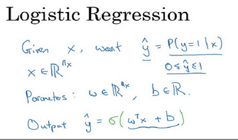

这时候我们得到的是一个关于输入$x$的线性函数，实际上这是你在做线性回归时所用到的，但是这对于二元分类问题来讲不是一个非常好的算法，因为你想让$\hat{y}$表示实际值$y$等于1的机率的话，$\hat{y}$ 应该在0到1之间。这是一个需要解决的问题，因为${{w}^{T}}x+b$可能比1要大得多，或者甚至为一个负值。对于你想要的在0和1之间的概率来说它是没有意义的，因此在逻辑回归中，我们的输出应该是$\hat{y}$等于由上面得到的线性函数式子作为自变量的**sigmoid**函数中，公式如上图最下面所示，将线性函数转换为非线性函数。

下图是**sigmoid**函数的图像，如果我把水平轴作为$z$轴，那么关于$z$的**sigmoid**函数是这样的，它是平滑地从0走向1，让我在这里标记纵轴，这是0，曲线与纵轴相交的截距是0.5，这就是关于$z$的**sigmoid**函数的图像。我们通常都使用$z$来表示${{w}^{T}}x+b$的值。


关于**sigmoid**函数的公式是这样的，$\sigma \left( z \right)=\frac{1}{1+{{e}^{-z}}}$,在这里$z$是一个实数，这里要说明一些要注意的事情，如果$z$非常大那么${{e}^{-z}}$将会接近于0，关于$z$的**sigmoid**函数将会近似等于1除以1加上某个非常接近于0的项，因为$e$ 的指数如果是个绝对值很大的负数的话，这项将会接近于0，所以如果$z$很大的话那么关于$z$的**sigmoid**函数会非常接近1。相反地，如果$z$非常小或者说是一个绝对值很大的负数，那么关于${{e}^{-z}}$这项会变成一个很大的数，你可以认为这是1除以1加上一个非常非常大的数，所以这个就接近于0。实际上你看到当$z$变成一个绝对值很大的负数，关于$z$的**sigmoid**函数就会非常接近于0，因此当你实现逻辑回归时，你的工作就是去让机器学习参数$w$以及$b$这样才使得$\hat{y}$成为对$y=1$这一情况的概率的一个很好的估计。


在继续进行下一步之前，介绍一种符号惯例，可以让参数$w$和参数$b$分开。在符号上要注意的一点是当我们对神经网络进行编程时经常会让参数$w$和参数$b$分开，在这里参数$b$对应的是一种偏置。在之前的机器学习课程里，你可能已经见过处理这个问题时的其他符号表示。比如在某些例子里，你定义一个额外的特征称之为${{x}_{0}}$，并且使它等于1，那么现在$X$就是一个$n_x$加1维的变量，然后你定义$\hat{y}=\sigma \left( {{\theta }^{T}}x \right)$的**sigmoid**函数。在这个备选的符号惯例里，你有一个参数向量${{\theta }_{0}},{{\theta }_{1}},{{\theta }_{2}},...,{{\theta }_{{{n}_{x}}}}$，这样${{\theta }_{0}}$就充当了$b$，这是一个实数，而剩下的${{\theta }_{1}}$ 直到${{\theta }_{{{n}_{x}}}}$充当了$w$，结果就是当你实现你的神经网络时，有一个比较简单的方法是保持$b$和$w$分开。但是在这节课里我们不会使用任何这类符号惯例，所以不用去担心。
现在你已经知道逻辑回归模型是什么样子了，下一步要做的是训练参数$w$和参数$b$，你需要定义一个代价函数，让我们在下节课里对其进行解释。

### 2.3 逻辑回归的代价函数（Logistic Regression Cost Function）

在上个视频中，我们讲了逻辑回归模型，这个视频里，我们讲逻辑回归的代价函数（也翻译作成本函数）。

**为什么需要代价函数：**

为了训练逻辑回归模型的参数参数$w$和参数$b$我们，需要一个代价函数，通过训练代价函数来得到参数$w$和参数$b$。先看一下逻辑回归的输出函数：


为了让模型通过学习调整参数，你需要给予一个$m$样本的训练集，这会让你在训练集上找到参数$w$和参数$b$,，来得到你的输出。

对训练集的预测值，我们将它写成$\hat{y}$，我们更希望它会接近于训练集中的$y$值，为了对上面的公式更详细的介绍，我们需要说明上面的定义是对一个训练样本来说的，这种形式也使用于每个训练样本，我们使用这些带有圆括号的上标来区分索引和样本，训练样本$i$所对应的预测值是${{y}^{(i)}}$,是用训练样本的${{w}^{T}}{{x}^{(i)}}+b$然后通过**sigmoid**函数来得到，也可以把$z$定义为${{z}^{(i)}}={{w}^{T}}{{x}^{(i)}}+b$,我们将使用这个符号$(i)$注解，上标$(i)$来指明数据表示$x$或者$y$或者$z$或者其他数据的第$i$个训练样本，这就是上标$(i)$的含义。

**损失函数：**

损失函数又叫做误差函数，用来衡量算法的运行情况，**Loss function:$L\left( \hat{y},y \right)$.**

我们通过这个$L$称为的损失函数，来衡量预测输出值和实际值有多接近。一般我们用预测值和实际值的平方差或者它们平方差的一半，但是通常在逻辑回归中我们不这么做，因为当我们在学习逻辑回归参数的时候，会发现我们的优化目标不是凸优化，只能找到多个局部最优值，梯度下降法很可能找不到全局最优值，虽然平方差是一个不错的损失函数，但是我们在逻辑回归模型中会定义另外一个损失函数。

我们在逻辑回归中用到的损失函数是：$L\left( \hat{y},y \right)=-y\log(\hat{y})-(1-y)\log (1-\hat{y})$

为什么要用这个函数作为逻辑损失函数？当我们使用平方误差作为损失函数的时候，你会想要让这个误差尽可能地小，对于这个逻辑回归损失函数，我们也想让它尽可能地小，为了更好地理解这个损失函数怎么起作用，我们举两个例子：

当$y=1$时损失函数$L=-\log (\hat{y})$，如果想要损失函数$L$尽可能得小，那么$\hat{y}$就要尽可能大，因为**sigmoid**函数取值$[0,1]$，所以$\hat{y}$会无限接近于1。

当$y=0$时损失函数$L=-\log (1-\hat{y})$，如果想要损失函数$L$尽可能得小，那么$\hat{y}$就要尽可能小，因为**sigmoid**函数取值$[0,1]$，所以$\hat{y}$会无限接近于0。

**在这门课中有很多的函数效果和现在这个类似，就是如果$y$等于1，我们就尽可能让$\hat{y}$变大，如果$y$等于0，我们就尽可能让 $\hat{y}$ 变小。**
损失函数是在单个训练样本中定义的，它衡量的是算法在单个训练样本中表现如何，为了衡量算法在全部训练样本上的表现如何，我们需要定义一个算法的代价函数，算法的代价函数是对$m$个样本的损失函数求和然后除以$m$:
$J\left( w,b \right)=\frac{1}{m}\sum\limits_{i=1}^{m}{L\left( {{{\hat{y}}}^{(i)}},{{y}^{(i)}} \right)}=\frac{1}{m}\sum\limits_{i=1}^{m}{\left( -{{y}^{(i)}}\log {{{\hat{y}}}^{(i)}}-(1-{{y}^{(i)}})\log (1-{{{\hat{y}}}^{(i)}}) \right)}$
损失函数只适用于像这样的单个训练样本，而代价函数是参数的总代价，所以在训练逻辑回归模型时候，我们需要找到合适的$w$和$b$，来让代价函数 $J$ 的总代价降到最低。
根据我们对逻辑回归算法的推导及对单个样本的损失函数的推导和针对算法所选用参数的总代价函数的推导，结果表明逻辑回归可以看做是一个非常小的神经网络，在下一个视频中，我们会看到神经网络会做什么。


### 2.4 梯度下降法（Gradient Descent）

**梯度下降法可以做什么？**

在你测试集上，通过最小化代价函数（成本函数）$J(w,b)$来训练的参数$w$和$b$， 


如图，在第二行给出和之前一样的逻辑回归算法的代价函数（成本函数）

**梯度下降法的形象化说明**

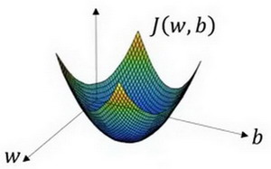

在这个图中，横轴表示你的空间参数$w$和$b$，在实践中，$w$可以是更高的维度，但是为了更好地绘图，我们定义$w$和$b$，都是单一实数，代价函数（成本函数）$J(w,b)$是在水平轴$w$和$b$上的曲面，因此曲面的高度就是$J(w,b)$在某一点的函数值。我们所做的就是找到使得代价函数（成本函数）$J(w,b)$函数值是最小值，对应的参数$w$和$b$。


如图，代价函数（成本函数）$J(w,b)$是一个凸函数(**convex function**)，像一个大碗一样。


如图，这就与刚才的图有些相反，因为它是非凸的并且有很多不同的局部最小值。由于逻辑回归的代价函数（成本函数）$J(w,b)$特性，我们必须定义代价函数（成本函数）$J(w,b)$为凸函数。
**初始化$w$和$b$，**


可以用如图那个小红点来初始化参数$w$和$b$，也可以采用随机初始化的方法，对于逻辑回归几乎所有的初始化方法都有效，因为函数是凸函数，无论在哪里初始化，应该达到同一点或大致相同的点。


我们以如图的小红点的坐标来初始化参数$w$和$b$。

**2. 朝最陡的下坡方向走一步，不断地迭代**


我们朝最陡的下坡方向走一步，如图，走到了如图中第二个小红点处。


我们可能停在这里也有可能继续朝最陡的下坡方向再走一步，如图，经过两次迭代走到第三个小红点处。

**3.直到走到全局最优解或者接近全局最优解的地方**

通过以上的三个步骤我们可以找到全局最优解，也就是代价函数（成本函数）$J(w,b)$这个凸函数的最小值点。

**梯度下降法的细节化说明（仅有一个参数）**


假定代价函数（成本函数）$J(w)$ 只有一个参数$w$，即用一维曲线代替多维曲线，这样可以更好画出图像。


迭代就是不断重复做如图的公式:

$:=$表示更新参数,

$a $ 表示学习率（**learning rate**），用来控制步长（**step**），即向下走一步的长度$\frac{dJ(w)}{dw}$  就是函数$J(w)$对$w$ 求导（**derivative**），在代码中我们会使用$dw$表示这个结果

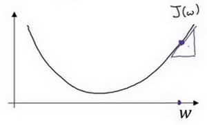

对于导数更加形象化的理解就是斜率（**slope**），如图该点的导数就是这个点相切于 $J(w)$的小三角形的高除宽。假设我们以如图点为初始化点，该点处的斜率的符号是正的，即$\frac{dJ(w)}{dw}>0$，所以接下来会向左走一步。


整个梯度下降法的迭代过程就是不断地向左走，直至逼近最小值点。

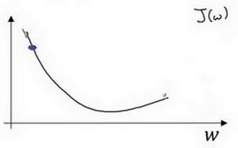

假设我们以如图点为初始化点，该点处的斜率的符号是负的，即$\frac{dJ(w)}{dw}<0$，所以接下来会向右走一步。


整个梯度下降法的迭代过程就是不断地向右走，即朝着最小值点方向走。

**梯度下降法的细节化说明（两个参数）**

逻辑回归的代价函数（成本函数）$J(w,b)$是含有两个参数的。


$\partial $ 表示求偏导符号，可以读作**round**，
$\frac{\partial J(w,b)}{\partial w}$  就是函数$J(w,b)$ 对$w$ 求偏导，在代码中我们会使用$dw$ 表示这个结果，
$\frac{\partial J(w,b)}{\partial b}$  就是函数$J(w,b)$对$b$ 求偏导，在代码中我们会使用$db$ 表示这个结果，
小写字母$d$ 用在求导数（**derivative**），即函数只有一个参数，
偏导数符号$\partial $ 用在求偏导（**partial derivative**），即函数含有两个以上的参数。


### 2.5 导数（Derivatives）

这个视频我主要是想帮你获得对微积分和导数直观的理解。或许你认为自从大学毕以后你再也没有接触微积分。这取决于你什么时候毕业，也许有一段时间了，如果你顾虑这点，请不要担心。为了高效应用神经网络和深度学习，你并不需要非常深入理解微积分。因此如果你观看这个视频或者以后的视频时心想：“哇哦，这些知识、这些运算对我来说很复杂。”我给你的建议是：坚持学习视频，最好下课后做作业，成功的完成编程作业，然后你就可以使用深度学习了。在第四周之后的学习中，你会看到定义的很多种类的函数，通过微积分他们能够帮助你把所有的知识结合起来，其中有的叫做前向函数和反向函数，因此你不需要了解所有你使用的那些微积分中的函数。所以你不用担心他们，除此之外在对深度学习的尝试中，这周我们要进一步深入了解微积分的细节。所有你只需要直观地认识微积分，用来构建和成功的应用这些算法。最后，如果你是精通微积分的那一小部分人群，你对微积分非常熟悉，你可以跳过这部分视频。其他同学让我们开始深入学习导数。

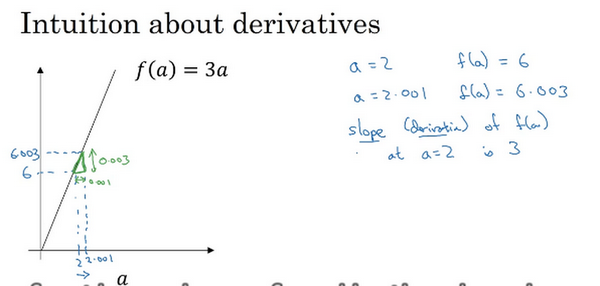

一个函数$f(a)=3a$，它是一条直线。下面我们来简单理解下导数。让我们看看函数中几个点，假定$a=2$，那么$f(a)$是$a$的3倍等于6，也就是说如果$a=2$，那么函数$f(a)=6$。假定稍微改变一点点$a$的值，只增加一点，变为2.001，这时$a$将向右做微小的移动。0.001的差别实在是太小了，不能在图中显示出来，我们把它右移一点，现在$f(a)$等于$a$的3倍是6.003，画在图里，比例不太符合。请看绿色高亮部分的这个小三角形，如果向右移动0.001，那么$f(a)$增加0.003，$f(a)$的值增加3倍于右移的$a$，因此我们说函数$f(a)$在$a=2$，.是这个导数的斜率，或者说，当$a=2$时，斜率是3。导数这个概念意味着斜率，导数听起来是一个很可怕、很令人惊恐的词，但是斜率以一种很友好的方式来描述导数这个概念。所以提到导数，我们把它当作函数的斜率就好了。更正式的斜率定义为在上图这个绿色的小三角形中，高除以宽。即斜率等于0.003除以0.001，等于3。或者说导数等于3，这表示当你将$a$右移0.001，$f(a)$的值增加3倍水平方向的量。

现在让我们从不同的角度理解这个函数。
假设$a=5$ ，此时$f(a)=3a=15$。
把$a$右移一个很小的幅度，增加到5.001，$f(a)=15.003$。
即在$a=5$ 时，斜率是3，这就是表示，当微小改变变量$a$的值，$\frac{df(a)}{da}=3$ 。一个等价的导数表达式可以这样写$\frac{d}{da}f(a)$  ，不管你是否将$f(a)$放在上面或者放在右边都没有关系。
在这个视频中，我讲解导数讨论的情况是我们将$a$偏移0.001，如果你想知道导数的数学定义，导数是你右移很小的$a$值（不是0.001，而是一个非常非常小的值）。通常导数的定义是你右移$a$(可度量的值)一个无限小的值，$f(a)$增加3倍（增加了一个非常非常小的值）。也就是这个三角形右边的高度。

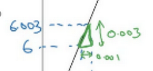

那就是导数的正式定义。但是为了直观的认识，我们将探讨右移$a=0.001$ 这个值，即使0.001并不是无穷小的可测数据。导数的一个特性是：这个函数任何地方的斜率总是等于3，不管$a=2$或 $a=5$，这个函数的斜率总等于3，也就是说不管$a$的值如何变化，如果你增加0.001，$f(a)$的值就增加3倍。这个函数在所有地方的斜率都相等。一种证明方式是无论你将小三角形画在哪里，它的高除以宽总是3。

我希望带给你一种感觉：什么是斜率？什么是导函数？对于一条直线，在例子中函数的斜率，在任何地方都是3。在下一个视频让我们看一个更复杂的例子，这个例子中函数在不同点的斜率是可变的。

### 2.6 更多的导数例子（More Derivative Examples）

在这个视频中我将给出一个更加复杂的例子，在这个例子中，函数在不同点处的斜率是不一样的，先来举个例子:


我在这里画一个函数，$f(a)={{\text{a}}^{\text{2}}}$，如果$a=\text{2}$ 的话，那么$f(a)=4$。让我们稍稍往右推进一点点，现在$a=\text{2}.\text{001}$ ，则$f(a)\approx 4.004$  (如果你用计算器算的话，这个准确的值应该为4.004。0.001 我只是为了简便起见，省略了后面的部分)，如果你在这儿画，一个小三角形，你就会发现，如果把$a$往右移动0.001，那么$f(a)$将增大四倍，即增大0.004。在微积分中我们把这个三角形斜边的斜率，称为$f(a)$在点$a=\text{2}$ 处的导数(即为4)，或者写成微积分的形式，当$a=\text{2}$  的时候， $\frac{d}{da}f(a)=4$  由此可知，函数$f(a)={{a}^{{2}}}$，在$a$取不同值的时候，它的斜率是不同的，这和上个视频中的例子是不同的。

这里有种直观的方法可以解释，为什么一个点的斜率，在不同位置会不同如果你在曲线上，的不同位置画一些小小的三角形你就会发现，三角形高和宽的比值，在曲线上不同的地方，它们是不同的。所以当$a=2$ 时，斜率为4；而当$a=5$时，斜率为10 。如果你翻看微积分的课本，课本会告诉你，函数$f(a)={{a}^{{2}}}$的斜率（即导数）为$2a$。这意味着任意给定一点$a$，如果你稍微将$a$，增大0.001，那么你会看到$f(a)$将增大$2a$，即增大的值为点在$a$处斜率或导数，乘以你向右移动的距离。

现在有个小细节需要注意，导数增大的值，不是刚好等于导数公式算出来的值，而只是根据导数算出来的一个估计值。

**为了总结这堂课所学的知识，我们再来看看几个例子：**


假设$f(a)={{a}^{\text{3}}}$ 如果你翻看导数公式表，你会发现这个函数的导数，等于$3{{a}^{2}}$。所以这是什么意思呢，同样地举一个例子：我们再次令$a=2$，所以${{a}^{3}}=8$ ，如果我们又将$a$增大一点点，你会发现$f(a)\approx 8.012$， 你可以自己检查一遍，如果我们取8.012，你会发现${{2.001}^{3}}$ ，和8.012很接近，事实上当$a=2$时，导数值为$3×{{2}^{2}}$，即$3×4=12$。所以导数公式，表明如果你将$a$向右移动0.001时，$f(a)$ 将会向右移动12倍，即0.012。

来看最后一个例子，假设$f(a)={{\log }_{e}}a$，有些可能会写作$\ln a$，函数$\log a$ 的斜率应该为$\frac{1}{a}$，所以我们可以解释如下：如果$a$取任何值，比如又取$a=2$，然后又把$a$向右边移动0.001 那么$f(a)$将增大$\frac{\text{1}}{a}\times \text{0}\text{.001}$，如果你借助计算器的话，你会发现当$a=2$时$f(a)\approx \text{0}\text{.69315}$ ；而$a=2.001$时，$f(a)\approx \text{0}\text{.69365}$。所以$f(a)$增大了0.0005，如果你查看导数公式，当$a=2$的时候，导数值$\frac{d}{da}f(a)=\frac{\text{1}}{\text{2}}$。这表明如果你把 增大0.001，$f(a)$将只会增大0.001的二分之一，即0.0005。如果你画个小三角形你就会发现，如果$x$ 轴增加了0.001，那么$y$ 轴上的函数$\log a$，将增大0.001的一半 即0.0005。所以 $\frac{1}{a}$ ，当$a=2$时这里是 ，就是当$a=2$时这条线的斜率。这些就是有关，导数的一些知识。

**在这个视频中，你只需要记住两点：**

第一点，导数就是斜率，而函数的斜率，在不同的点是不同的。在第一个例子中$f(a)=\text{3}a$ ，这是一条直线，在任何点它的斜率都是相同的，均为3。但是对于函数$f(a)={{\text{a}}^{\text{2}}}$ ，或者$f(a)=\log a$，它们的斜率是变化的，所以它们的导数或者斜率，在曲线上不同的点处是不同的。

第二点，如果你想知道一个函数的导数，你可参考你的微积分课本或者维基百科，然后你应该就能找到这些函数的导数公式。

最后我希望，你能通过我生动的讲解，掌握这些有关导数和斜率的知识，下一课我们将讲解计算图，以及如何用它来求更加复杂的函数的导数。

### 2.7 计算图（Computation Graph）

可以说，一个神经网络的计算，都是按照前向或反向传播过程组织的。首先我们计算出一个新的网络的输出（前向过程），紧接着进行一个反向传输操作。后者我们用来计算出对应的梯度或导数。计算图解释了为什么我们用这种方式组织这些计算过程。在这个视频中，我们将举一个例子说明计算图是什么。让我们举一个比逻辑回归更加简单的，或者说不那么正式的神经网络的例子。


我们尝试计算函数$J$，$J$是由三个变量$a,b,c$组成的函数，这个函数是$\text{3(a}+\text{bc)}$ 。计算这个函数实际上有三个不同的步骤，首先是计算 $b$ 乘以 $c$，我们把它储存在变量$u$中，因此${u}={bc}$；
然后计算$v=a+u$；最后输出$J=3v$，这就是要计算的函数$J$。我们可以把这三步画成如下的计算图，我先在这画三个变量$a,b,c$，第一步就是计算$u=bc$，我在这周围放个矩形框，它的输入是$b,c$，接着第二步$v=a+u$，最后一步$J=3v$。
举个例子: $a=5,b=3,c=2$ ，$u=bc$就是6，$v=a+u$ ，就是5+6=11。$J$是3倍的 ，因此。即$3×(5+3×2)$。如果你把它算出来，实际上得到33就是$J$的值。
当有不同的或者一些特殊的输出变量时，例如本例中的$J$和逻辑回归中你想优化的代价函数$J$，因此计算图用来处理这些计算会很方便。从这个小例子中我们可以看出，通过一个从左向右的过程，你可以计算出$J$的值。为了计算导数，从右到左（红色箭头，和蓝色箭头的过程相反）的过程是用于计算导数最自然的方式。
概括一下：计算图组织计算的形式是用蓝色箭头从左到右的计算，让我们看看下一个视频中如何进行反向红色箭头(也就是从右到左)的导数计算，让我们继续下一个视频的学习。


### 2.8 使用计算图求导数（Derivatives with a Computation Graph）

在上一个视频中，我们看了一个例子使用流程计算图来计算函数J。现在我们清理一下流程图的描述，看看你如何利用它计算出函数$J$的导数。

下面用到的公式：

$\frac{dJ}{du}=\frac{dJ}{dv}\frac{dv}{du}$  ，         $\frac{dJ}{db}=\frac{dJ}{du}\frac{du}{db}$ ，          $\frac{dJ}{da}=\frac{dJ}{du}\frac{du}{da}$

这是一个流程图：


假设你要计算$\frac{{dJ}}{{dv}}$，那要怎么算呢？好，比如说，我们要把这个$v$值拿过来，改变一下，那么$J$的值会怎么变呢？

所以定义上$J = 3v$，现在$v=11$，所以如果你让$v$增加一点点，比如到11.001，那么$J =3v =33.003$，所以我这里$v$增加了0.001，然后最终结果是$J$上升到原来的3倍，所以$\frac{{dJ}}{{dv}}=3$，因为对于任何 $v$ 的增量$J$都会有3倍增量，而且这类似于我们在上一个视频中的例子，我们有$f(a)=3a$，然后我们推导出$\frac{{df}(a)}{{da}}= 3$，所以这里我们有$J=3v$，所以$\frac{{dJ}}{{dv}} =3$，这里$J$扮演了$f$的角色，在之前的视频里的例子。

在反向传播算法中的术语，我们看到，如果你想计算最后输出变量的导数，使用你最关心的变量对$v$的导数，那么我们就做完了一步反向传播，在这个流程图中是一个反向步骤。


我们来看另一个例子，$\frac{{dJ}}{da}$是多少呢？换句话说，如果我们提高$a$的数值，对$J$的数值有什么影响？

好，我们看看这个例子。变量$a=5$，我们让它增加到5.001，那么对v的影响就是$a+u$，之前$v=11$，现在变成11.001，我们从上面看到现在$J$ 就变成33.003了，所以我们看到的是，如果你让$a$增加0.001，$J$增加0.003。那么增加$a$，我是说如果你把这个5换成某个新值，那么$a$的改变量就会传播到流程图的最右，所以$J$最后是33.003。所以J的增量是3乘以$a$的增量，意味着这个导数是3。


要解释这个计算过程，其中一种方式是：如果你改变了$a$，那么也会改变$v$，通过改变$v$，也会改变$J$，所以$J$值的净变化量，当你提升这个值（0.001），当你把$a$值提高一点点，这就是$J$的变化量（0.003）。


首先a增加了，$v$也会增加，$v$增加多少呢？这取决于$\frac{{dv}}{da}$，然后$v$的变化导致$J$也在增加，所以这在微积分里实际上叫链式法则，如果$a$影响到$v$，$v$影响到$J$，那么当你让$a$变大时，$J$的变化量就是当你改变$a$时，$v$的变化量乘以改变$v$时$J$的变化量，在微积分里这叫链式法则。


我们从这个计算中看到，如果你让$a$增加0.001，$v$也会变化相同的大小，所以$\frac{{dv}}{da}= 1$。事实上，如果你代入进去，我们之前算过$\frac{{dJ}}{{dv}} =3$，$\frac{{dv}}{da} =1$，所以这个乘积3×1，实际上就给出了正确答案，$\frac{{dJ}}{da} = 3$。

这张小图表示了如何计算，$\frac{{dJ}}{{dv}}$就是$J$对变量$v$的导数，它可以帮助你计算$\frac{{dJ}}{da}$，所以这是另一步反向传播计算。


现在我想介绍一个新的符号约定，当你编程实现反向传播时，通常会有一个最终输出值是你要关心的，最终的输出变量，你真正想要关心或者说优化的。在这种情况下最终的输出变量是J，就是流程图里最后一个符号，所以有很多计算尝试计算输出变量的导数，所以输出变量对某个变量的导数，我们就用$dvar$命名，所以在很多计算中你需要计算最终输出结果的导数，在这个例子里是$J$，还有各种中间变量，比如$a、b、c、u、v$，当你在软件里实现的时候，变量名叫什么？你可以做的一件事是，在**python**中，你可以写一个很长的变量名，比如${dFinalOutputvar}\_{dvar}$，但这个变量名有点长，我们就用$dJ\_dvar$，但因为你一直对$dJ$求导，对这个最终输出变量求导。我这里要介绍一个新符号，在程序里，当你编程的时候，在代码里，我们就使用变量名$dvar$，来表示那个量。


好，所以在程序里是$dvar$表示导数，你关心的最终变量$J$的导数，有时最后是$L$，对代码中各种中间量的导数，所以代码里这个东西，你用$dv$表示这个值，所以$dv=3$，你的代码表示就是$da=3$。


好，所以我们通过这个流程图完成部分的后向传播算法。我们在下一张幻灯片看看这个例子剩下的部分。

我们清理出一张新的流程图，我们回顾一下，到目前为止，我们一直在往回传播，并计算$dv=3$，再次，$dv$是代码里的变量名，其真正的定义是$\frac{{dJ}}{{dv}}$。我发现$da=3$，再次，$da$是代码里的变量名，其实代表$\frac{{dJ}}{da}$的值。


大概手算了一下，两条直线怎么计算反向传播。

好，我们继续计算导数，我们看看这个值$u$，那么$\frac{dJ}{du}$是多少呢？通过和之前类似的计算，现在我们从$u=6$出发，如果你令$u$增加到6.001，那么$v$之前是11，现在变成11.001了，$J$ 就从33变成33.003，所以$J$ 增量是3倍，所以$\frac{{dJ}}{du}= 3$。对$u$的分析很类似对a的分析，实际上这计算起来就是$\frac{{dJ}}{dv}\cdot \frac{{dv}}{du}$，有了这个，我们可以算出$\frac{{dJ}}{dv} =3$，$\frac{{dv}}{du} = 1$，最终算出结果是$3×1=3$。


所以我们还有一步反向传播，我们最终计算出$du=3$，这里的$du$当然了，就是$\frac{{dJ}}{du}$。

现在，我们仔细看看最后一个例子，那么$\frac{{dJ}}{db}$呢？想象一下，如果你改变了$b$的值，你想要然后变化一点，让$J$ 值到达最大或最小，那么导数是什么呢？这个$J$函数的斜率，当你稍微改变$b$值之后。事实上，使用微积分链式法则，这可以写成两者的乘积，就是$\frac{{dJ}}{du}\cdot \frac{{du}}{db}$，理由是，如果你改变$b$一点点，所以$b$变化比如说3.001，它影响J的方式是，首先会影响$u$，它对$u$的影响有多大？好，$u$的定义是$b\cdot c$，所以$b=3$时这是6，现在就变成6.002了，对吧，因为在我们的例子中$c=2$，所以这告诉我们$\frac{{du}}{db}= 2$当你让$b$增加0.001时，$u$就增加两倍。所以$\frac{{du}}{db} =2$，现在我想$u$的增加量已经是$b$的两倍，那么$\frac{{dJ}}{du}$是多少呢？我们已经弄清楚了，这等于3，所以让这两部分相乘，我们发现$\frac{{dJ}}{db}= 6$。

好，这就是第二部分的推导，其中我们想知道 $u$ 增加0.002，会对$J$ 有什么影响。实际上$\frac{{dJ}}{du}=3$，这告诉我们u增加0.002之后，$J$上升了3倍，那么$J$ 应该上升0.006，对吧。这可以从$\frac{{dJ}}{du}= 3$推导出来。

如果你仔细看看这些数学内容，你会发现，如果$b$变成3.001，那么$u$就变成6.002，$v$变成11.002，然后$J=3v=33.006$，对吧？这就是如何得到$\frac{{dJ}}{db}= 6$。


为了填进去，如果我们反向走的话，$db=6$，而$db$其实是**Python**代码中的变量名，表示$\frac{{dJ}}{db}$。


我不会很详细地介绍最后一个例子，但事实上，如果你计算$\frac{{dJ}}{dc} =\frac{{dJ}}{du}\cdot \frac{{du}}{dc} = 3 \times 3$，这个结果是9。

我不会详细说明这个例子，在最后一步，我们可以推出$dc=9$。


所以这个视频的要点是，对于那个例子，当计算所有这些导数时，最有效率的办法是从右到左计算，跟着这个红色箭头走。特别是当我们第一次计算对$v$的导数时，之后在计算对$a$导数就可以用到。然后对$u$的导数，比如说这个项和这里这个项：


可以帮助计算对$b$的导数，然后对$c$的导数。

所以这是一个计算流程图，就是正向或者说从左到右的计算来计算成本函数J，你可能需要优化的函数，然后反向从右到左计算导数。如果你不熟悉微积分或链式法则，我知道这里有些细节讲的很快，但如果你没有跟上所有细节，也不用怕。在下一个视频中，我会再过一遍。在逻辑回归的背景下过一遍，并给你介绍需要做什么才能编写代码，实现逻辑回归模型中的导数计算。

### 2.9 逻辑回归中的梯度下降（Logistic Regression Gradient Descent）

本节我们讨论怎样通过计算偏导数来实现逻辑回归的梯度下降算法。它的关键点是几个重要公式，其作用是用来实现逻辑回归中梯度下降算法。但是在本节视频中，我将使用计算图对梯度下降算法进行计算。我必须要承认的是，使用计算图来计算逻辑回归的梯度下降算法有点大材小用了。但是，我认为以这个例子作为开始来讲解，可以使你更好的理解背后的思想。从而在讨论神经网络时，你可以更深刻而全面地理解神经网络。接下来让我们开始学习逻辑回归的梯度下降算法。

假设样本只有两个特征${{x}_{1}}$和${{x}_{2}}$，为了计算$z$，我们需要输入参数${{w}_{1}}$、${{w}_{2}}$ 和$b$，除此之外还有特征值${{x}_{1}}$和${{x}_{2}}$。因此$z$的计算公式为：
$z={{w}_{1}}{{x}_{1}}+{{w}_{2}}{{x}_{2}}+b$ 
回想一下逻辑回归的公式定义如下：
$\hat{y}=a=\sigma (z)$
其中$z={{w}^{T}}x+b$ 
$\sigma \left( z \right)=\frac{1}{1+{{e}^{-z}}}$
损失函数：
$L( {{{\hat{y}}}^{(i)}},{{y}^{(i)}})=-{{y}^{(i)}}\log {{\hat{y}}^{(i)}}-(1-{{y}^{(i)}})\log (1-{{\hat{y}}^{(i)}})$ 
代价函数：
$J\left( w,b \right)=\frac{1}{m}\sum\nolimits_{i}^{m}{L( {{{\hat{y}}}^{(i)}},{{y}^{(i)}})}$ 
假设现在只考虑单个样本的情况，单个样本的代价函数定义如下：
$L(a,y)=-(y\log (a)+(1-y)\log (1-a))$ 
其中$a$是逻辑回归的输出，$y$是样本的标签值。现在让我们画出表示这个计算的计算图。
这里先复习下梯度下降法，$w$和$b$的修正量可以表达如下：

$w:=w-a \frac{\partial J(w,b)}{\partial w}$，$b:=b-a\frac{\partial J(w,b)}{\partial b}$


如图：在这个公式的外侧画上长方形。然后计算：
$\hat{y}=a=\sigma(z)$
也就是计算图的下一步。最后计算损失函数$L(a,y)$。
有了计算图，我就不需要再写出公式了。因此，为了使得逻辑回归中最小化代价函数$L(a,y)$，我们需要做的仅仅是修改参数$w$和$b$的值。前面我们已经讲解了如何在单个训练样本上计算代价函数的前向步骤。现在让我们来讨论通过反向计算出导数。
因为我们想要计算出的代价函数$L(a,y)$的导数，首先我们需要反向计算出代价函数$L(a,y)$关于$a$的导数，在编写代码时，你只需要用$da$ 来表示$\frac{dL(a,y)}{da}$  。
通过微积分得到：
$\frac{dL(a,y)}{da}=-y/a+(1-y)/(1-a)$ 
如果你不熟悉微积分，也不必太担心，我们会列出本课程涉及的所有求导公式。那么如果你非常熟悉微积分，我们鼓励你主动推导前面介绍的代价函数的求导公式，使用微积分直接求出$L(a,y)$关于变量$a$的导数。如果你不太了解微积分，也不用太担心。现在我们已经计算出$da$，也就是最终输出结果的导数。
现在可以再反向一步，在编写**Python**代码时，你只需要用$dz$来表示代价函数$L$关于$z$ 的导数$\frac{dL}{dz}$，也可以写成$\frac{dL(a,y)}{dz}$，这两种写法都是正确的。
$\frac{dL}{dz}=a-y$ 。
因为$\frac{dL(a,y)}{dz}=\frac{dL}{dz}=(\frac{dL}{da})\cdot (\frac{da}{dz})$，
并且$\frac{da}{dz}=a\cdot (1-a)$，
而 $\frac{dL}{da}=(-\frac{y}{a}+\frac{(1-y)}{(1-a)})$，因此将这两项相乘，得到：

${dz} = \frac{{dL}(a,y)}{{dz}} = \frac{{dL}}{{dz}} = \left( \frac{{dL}}{{da}} \right) \cdot \left(\frac{{da}}{{dz}} \right) = ( - \frac{y}{a} + \frac{(1 - y)}{(1 - a)})\cdot a(1 - a) = a - y$

视频中为了简化推导过程，假设${{n}_{x}}$ 这个推导的过程就是我之前提到过的链式法则。如果你对微积分熟悉，放心地去推导整个求导过程，如果不熟悉微积分，你只需要知道$dz=(a-y)$已经计算好了。

现在进行最后一步反向推导，也就是计算$w$和$b$变化对代价函数$L$的影响，特别地，可以用:
$d{{w}_{1}}=\frac{1}{m}\sum\limits_{i}^{m}{x_{1}^{(i)}}({{a}^{(i)}}-{{y}^{(i)}})$ 
$d{{w}_{2}}=\frac{1}{m}\sum\limits_{i}^{m}{x_{2}^{(i)}}({{a}^{(i)}}-{{y}^{(i)}})$ 
$db=\frac{1}{m}\sum\limits_{i}^{m}{({{a}^{(i)}}-{{y}^{(i)}})}$ 
视频中，
$d{{w}_{1}}$ 表示$\frac{\partial L}{\partial {{w}_{1}}}={{x}_{1}}\cdot dz$， 
$d{{w}_{\text{2}}}$ 表示$\frac{\partial L}{\partial {{w}_{2}}}={{x}_{2}}\cdot dz$，
$db=dz$。
因此，关于单个样本的梯度下降算法，你所需要做的就是如下的事情：
使用公式$dz=(a-y)$计算$dz$，
使用$d{{w}_{1}}={{x}_{1}}\cdot dz$ 计算$d{{w}_{1}}$， $d{{w}_{2}}={{x}_{2}}\cdot dz$计算$d{{w}_{2}}$，
$db=dz$ 来计算$db$，
然后:
更新${{w}_{1}}={{w}_{1}}-a d{{w}_{1}}$，
更新${{w}_{2}}={{w}_{2}}-a d{{w}_{2}}$，
更新$b=b-\alpha db$。
这就是关于单个样本实例的梯度下降算法中参数更新一次的步骤。


现在你已经知道了怎样计算导数，并且实现针对单个训练样本的逻辑回归的梯度下降算法。但是，训练逻辑回归模型不仅仅只有一个训练样本，而是有$m$个训练样本的整个训练集。因此在下一节视频中，我们将这些思想应用到整个训练样本集中，而不仅仅只是单个样本上。

### 2.10  m 个样本的梯度下降(Gradient Descent on m Examples)

在之前的视频中,你已经看到如何计算导数，以及应用梯度下降在逻辑回归的一个训练样本上。现在我们想要把它应用在$m$个训练样本上。

![02-10-Gradient [00_02_18][20170816-103833-9]](../images/bf930b1f68d8e0726dda5393afc83672.png)

首先，让我们时刻记住有关于损失函数$J(w,b)$的定义。

$J(w,b)=\frac{1}{m}\sum\limits_{i=1}^{m}{L({{a}^{(i)}},{{y}^{(i)}})}$ 

当你的算法输出关于样本$y$的${{a}^{(i)}}$，${{a}^{(i)}}$是训练样本的预测值，即：$\sigma ( {{z}^{(i)}})=\sigma( {{w}^{T}}{{x}^{\left( i \right)}}+b)$。 
所以我们在前面的幻灯中展示的是对于任意单个训练样本，如何计算微分当你只有一个训练样本。因此$d{{w}_{1}}$，$d{{w}_{\text{2}}}$和$db$ 添上上标$i$表示你求得的相应的值。如果你面对的是我们在之前的幻灯中演示的那种情况，但只使用了一个训练样本$({{x}^{(i)}},{{y}^{(i)}})$。 
现在你知道带有求和的全局代价函数，实际上是1到$m$项各个损失的平均。 所以它表明全局代价函数对${{w}_{1}}$的微分，对${{w}_{1}}$的微分也同样是各项损失对${{w}_{1}}$微分的平均。


但之前我们已经演示了如何计算这项，即之前幻灯中演示的如何对单个训练样本进行计算。所以你真正需要做的是计算这些微分，如我们在之前的训练样本上做的。并且求平均，这会给你全局梯度值，你能够把它直接应用到梯度下降算法中。

所以这里有很多细节，但让我们把这些装进一个具体的算法。同时你需要一起应用的就是逻辑回归和梯度下降。

我们初始化$J=0,d{{w}_{1}}=0,d{{w}_{2}}=0,db=0$

代码流程：

```
J=0;dw1=0;dw2=0;db=0;
for i = 1 to m
    z(i) = wx(i)+b;
    a(i) = sigmoid(z(i));
    J += -[y(i)log(a(i))+(1-y(i)）log(1-a(i));
    dz(i) = a(i)-y(i);
    dw1 += x1(i)dz(i);
    dw2 += x2(i)dz(i);
    db += dz(i);
J/= m;
dw1/= m;
dw2/= m;
db/= m;
w=w-alpha*dw
b=b-alpha*db
```

幻灯片上只应用了一步梯度下降。因此你需要重复以上内容很多次，以应用多次梯度下降。看起来这些细节似乎很复杂，但目前不要担心太多。希望你明白，当你继续尝试并应用这些在编程作业里，所有这些会变的更加清楚。

但这种计算中有两个缺点，也就是说应用此方法在逻辑回归上你需要编写两个**for**循环。第一个**for**循环是一个小循环遍历$m$个训练样本，第二个**for**循环是一个遍历所有特征的**for**循环。这个例子中我们只有2个特征，所以$n$等于2并且${{n}_{x}}$ 等于2。 但如果你有更多特征，你开始编写你的因此$d{{w}_{1}}$，$d{{w}_{2}}$，你有相似的计算从$d{{w}_{3}}$一直下去到$d{{w}_{n}}$。所以看来你需要一个**for**循环遍历所有$n$个特征。

当你应用深度学习算法，你会发现在代码中显式地使用**for**循环使你的算法很低效，同时在深度学习领域会有越来越大的数据集。所以能够应用你的算法且没有显式的**for**循环会是重要的，并且会帮助你适用于更大的数据集。所以这里有一些叫做向量化技术,它可以允许你的代码摆脱这些显式的**for**循环。

我想在先于深度学习的时代，也就是深度学习兴起之前，向量化是很棒的。可以使你有时候加速你的运算，但有时候也未必能够。但是在深度学习时代向量化，摆脱for循环已经变得相当重要。因为我们越来越多地训练非常大的数据集，因此你真的需要你的代码变得非常高效。所以在接下来的几个视频中，我们会谈到向量化，以及如何应用向量化而连一个**for**循环都不使用。所以学习了这些，我希望你有关于如何应用逻辑回归，或是用于逻辑回归的梯度下降，事情会变得更加清晰。当你进行编程练习，但在真正做编程练习之前让我们先谈谈向量化。然后你可以应用全部这些东西，应用一个梯度下降的迭代而不使用任何**for**循环。


### 2.11 向量化(Vectorization)

参考视频: 2.11 向量化

向量化是非常基础的去除代码中**for**循环的艺术，在深度学习安全领域、深度学习实践中，你会经常发现自己训练大数据集，因为深度学习算法处理大数据集效果很棒，所以你的代码运行速度非常重要，否则如果在大数据集上，你的代码可能花费很长时间去运行，你将要等待非常长的时间去得到结果。所以在深度学习领域，运行向量化是一个关键的技巧，让我们举个栗子说明什么是向量化。

在逻辑回归中你需要去计算$z={{w}^{T}}x+b$，$w$、$x$都是列向量。如果你有很多的特征那么就会有一个非常大的向量，所以$w\in {{\mathbb{R}}^{{{n}_{x}}}}$ , $x\in{{\mathbb{R}}^{{{n}_{x}}}}$，所以如果你想使用非向量化方法去计算${{w}^{T}}x$，你需要用如下方式（**python**）

```
z=0
for i in range(n_x):
    z += w[i]*x[i]
z += b
```

这是一个非向量化的实现，你会发现这真的很慢，作为一个对比，向量化实现将会非常直接计算${{w}^{T}}x$，代码如下：

`z=np.dot(w,x)+b`

这是向量化计算${{w}^{T}}x$的方法，你将会发现这个非常快


让我们用一个小例子说明一下，在我的我将会写一些代码（以下为教授在他的**Jupyter notebook**上写的**Python**代码，）

```
import numpy as np #导入numpy库
a = np.array([1,2,3,4]) #创建一个数据a
print(a)
# [1 2 3 4]

import time #导入时间库
a = np.random.rand(1000000)
b = np.random.rand(1000000) #通过round随机得到两个一百万维度的数组
tic = time.time() #现在测量一下当前时间

#向量化的版本
c = np.dot(a,b)
toc = time.time()
print("Vectorized version:" + str(1000*(toc-tic)) +"ms") #打印一下向量化的版本的时间

#继续增加非向量化的版本
c = 0
tic = time.time()
for i in range(1000000):
    c += a[i]*b[i]
toc = time.time()
print(c)
print("For loop:" + str(1000*(toc-tic)) + "ms")#打印for循环的版本的时间
```

返回值见图。

在两个方法中，向量化和非向量化计算了相同的值，如你所见，向量化版本花费了1.5毫秒，非向量化版本的**for**循环花费了大约几乎500毫秒，非向量化版本多花费了300倍时间。所以在这个例子中，仅仅是向量化你的代码，就会运行300倍快。这意味着如果向量化方法需要花费一分钟去运行的数据，**for**循环将会花费5个小时去运行。

一句话总结，以上都是再说和for循环相比，向量化可以快速得到结果。

你可能听过很多类似如下的话，“大规模的深度学习使用了**GPU**或者图像处理单元实现”，但是我做的所有的案例都是在**jupyter notebook**上面实现，这里只有**CPU**，**CPU**和**GPU**都有并行化的指令，他们有时候会叫做**SIMD**指令，这个代表了一个单独指令多维数据，这个的基础意义是，如果你使用了**built-in**函数,像`np.function`或者并不要求你实现循环的函数，它可以让**python**的充分利用并行化计算，这是事实在**GPU**和**CPU**上面计算，**GPU**更加擅长**SIMD**计算，但是**CPU**事实上也不是太差，可能没有**GPU**那么擅长吧。接下来的视频中，你将看到向量化怎么能够加速你的代码，经验法则是，无论什么时候，避免使用明确的**for**循环。

以下代码及运行结果截图：

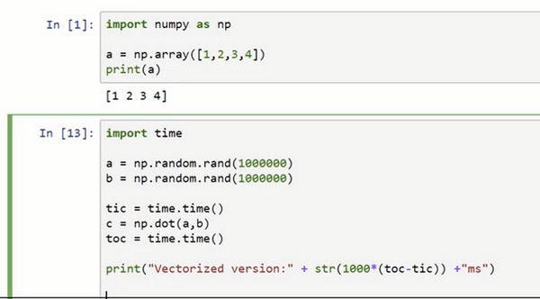

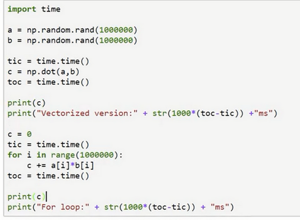


### 2.12 向量化的更多例子（More Examples of Vectorization）

从上节视频中，你知道了怎样通过**numpy**内置函数和避开显式的循环(**loop**)的方式进行向量化，从而有效提高代码速度。

经验提醒我，当我们在写神经网络程序时，或者在写逻辑(l**ogistic**)回归，或者其他神经网络模型时，应该避免写循环(**loop**)语句。虽然有时写循环(**loop**)是不可避免的，但是我们可以使用比如**numpy**的内置函数或者其他办法去计算。当你这样使用后，程序效率总是快于循环(**loop)**。

让我们看另外一个例子。如果你想计算向量$u=Av$，这时矩阵乘法定义为，矩阵乘法的定义就是：$u_{i} =\sum_{j}^{}{A_{\text{ij}}v_{i}}$，这取决于你怎么定义$u_{i}$值。同样使用非向量化实现，$u=np.zeros(n,1)$， 并且通过两层循环$for(i):for(j):$，得到$u[i]=u[i]+A[i][j]*v[j]$ 。现在就有了$i$ 和 $j$ 的两层循环，这就是非向量化。向量化方式就可以用$u=np.dot(A,v)$，右边这种向量化实现方式，消除了两层循环使得代码运行速度更快。 	

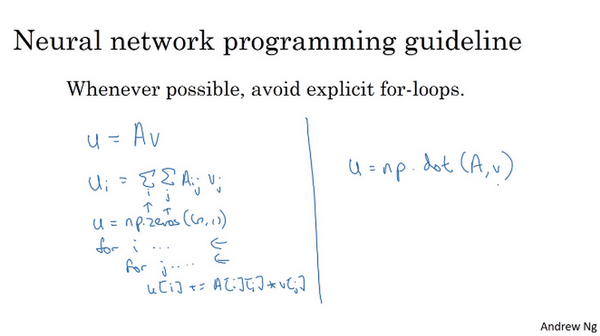

下面通过另一个例子继续了解向量化。如果你已经有一个向量$v$，并且想要对向量$v$的每个元素做指数操作，得到向量$u$等于$e$的$v_1$，$e$的$v_2$，一直到$e$的$v_n$次方。这里是非向量化的实现方式，首先你初始化了向量$u=np.zeros(n,1)$，并且通过循环依次计算每个元素。但事实证明可以通过**python**的**numpy**内置函数，帮助你计算这样的单个函数。所以我会引入`import numpy as np`，执行 $u=np.exp(v)$ 命令。注意到，在之前有循环的代码中，这里仅用了一行代码，向量$v$作为输入，$u$作为输出。你已经知道为什么需要循环，并且通过右边代码实现，效率会明显的快于循环方式。

事实上，**numpy**库有很多向量函数。比如 `u=np.log`是计算对数函数($log$)、 `np.abs()` 计算数据的绝对值、`np.maximum(v, 0)` 按元素计算$v$中每个元素和和0相比的最大值，`v**2` 代表获得元素 $v$ 每个值的平方、 `1/v` 获取 $v$ 中每个元素的倒数等等。所以当你想写循环时候，检查**numpy**是否存在类似的内置函数，从而避免使用循环(**loop**)方式。


那么，将刚才所学到的内容，运用在逻辑回归的梯度下降上，看看我们是否能简化两个计算过程中的某一步。这是我们逻辑回归的求导代码，有两层循环。在这例子我们有$n$个特征值。如果你有超过两个特征时，需要循环 $dw_1$ 、$dw_2$ 、$dw_3$ 等等。所以 $j$ 的实际值是1、2 和 $n_x$，就是你想要更新的值。所以我们想要消除第二循环，在这一行，这样我们就不用初始化 $dw_1$ ， $dw_2$ 都等于0。去掉这些，而是定义 $dw$ 为一个向量，设置 $u=np.zeros(n(x),1)$。定义了一个$x$行的一维向量，从而替代循环。我们仅仅使用了一个向量操作 $dw=dw+x^{(i)}dz^{(i)}$ 。最后，我们得到 $dw=dw/m$ 。现在我们通过将两层循环转成一层循环，我们仍然还有这个循环训练样本。


希望这个视频给了你一点向量化感觉，减少一层循环使你代码更快，但事实证明我们能做得更好。所以在下个视频，我们将进一步的讲解逻辑回归，你将会看到更好的监督学习结果。在训练中不需要使用任何 **for** 循环，你也可以写出代码去运行整个训练集。到此为止一切都好，让我们看下一个视频。

### 2.13 向量化逻辑回归(Vectorizing Logistic Regression)

我们已经讨论过向量化是如何显著加速你的代码，在本次视频中我们将讨论如何实现逻辑回归的向量化计算。这样就能处理整个数据集，甚至不会用一个明确的for循环就能实现对于整个数据集梯度下降算法的优化。我对这项技术感到非常激动，并且当我们后面谈到神经网络时同样也不会用到一个明确的 **for** 循环。

让我们开始吧，首先我们回顾一下逻辑回归的前向传播步骤。所以，如果你有 $m$ 个训练样本，然后对第一个样本进行预测，你需要这样计算。计算 $z$，我正在使用这个熟悉的公式 $z^{(1)}=w^{T}x^{(1)}+b$ 。然后计算激活函数 $a^{(1)}=\sigma (z^{(1)})$ ，计算第一个样本的预测值 $y$ 。

然后对第二个样本进行预测，你需要计算 $z^{(2)}=w^{T}x^{(2)}+b$ ， $a^{(2)}=\sigma (z^{(2)})$ 。然后对第三个样本进行预测，你需要计算 $z^{(3)}=w^{T}x^{(3)}+b$ ， $a^{(3)}=\sigma (z^{(3)})$ ，依次类推。如果你有 $m$ 个训练样本，你可能需要这样做 $m$ 次，可以看出，为了完成前向传播步骤，即对我们的 $m$ 个样本都计算出预测值。有一个办法可以并且不需要任何一个明确的**for**循环。让我们来看一下你该怎样做。

首先，回忆一下我们曾经定义了一个矩阵 $X$ 作为你的训练输入，(如下图中蓝色 $X$ )像这样在不同的列中堆积在一起。这是一个 $n_x$ 行 $m$ 列的矩阵。我现在将它写为**Python numpy**的形式 $$(n_{x},m)$$ ，这只是表示 $X$ 是一个 $n_x$ 乘以 $m$ 的矩阵 $$R^{n_x \times m}$$。

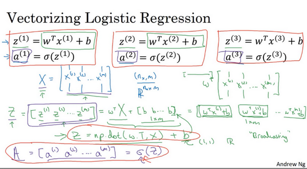

现在我首先想做的是告诉你该如何在一个步骤中计算 $z_1$、 $z_2$ 、$z_3$ 等等。实际上，只用了一行代码。所以，我打算先构建一个 $1\times m$ 的矩阵，实际上它是一个行向量，同时我准备计算 $z^{(1)}$， $z^{(2)}$ ……一直到 $z^{(m)}$ ，所有值都是在同一时间内完成。结果发现它可以表达为 $w$ 的转置乘以大写矩阵 $x$ 然后加上向量 $[b b...b]$ ， $([z^{(1)} z^{(2)}...z^{(m)}]=w^{T}+[bb...b])$ 。$[b b...b]$ 是一个 $1\times m$ 的向量或者 $1\times m$ 的矩阵或者是一个 $m$ 维的行向量。所以希望你熟悉矩阵乘法，你会发现的 $w$ 转置乘以 $x^{(1)}$ ， $x^{(2)}$ 一直到 $x^{(m)}$ 。所以 $w$ 转置可以是一个行向量。所以第一项 $w^{T}X$ 将计算 $w$ 的转置乘以 $x^{(1)}$， $w$ 转置乘以$x^{(2)}$ 等等。然后我们加上第二项 $[b b...b]$ ，你最终将 $b$ 加到了每个元素上。所以你最终得到了另一个 $1\times m$ 的向量， $[z^{(1)} z^{(2)}...z^{(m)}]=w^{T}X+[b b...b]=[w^{T}x^{(1)}+b,w^{T}x^{(2)}+b...w^{T}x^{(m)}+b]$ 。

$w^{T}x^{(1)}+b$ 这是第一个元素，$w^{T}x^{(2)}+b$ 这是第二个元素， $w^{T}x^{(m)}+b$ 这是第 $m$ 个元素。

如果你参照上面的定义，第一个元素恰好是 $z^{(1)}$ 的定义，第二个元素恰好是 $z^{(2)}$ 的定义，等等。所以，因为$X$是一次获得的，当你得到你的训练样本，一个一个横向堆积起来，这里我将 $[z^{(1)} z^{(2)} ... z^{(m)}]$ 定义为大写的 $Z$ ，你用小写 $z$ 表示并将它们横向排在一起。所以当你将不同训练样本对应的小写 $x$ 横向堆积在一起时得到大写变量 $X$ 并且将小写变量也用相同方法处理，将它们横向堆积起来，你就得到大写变量 $Z$ 。结果发现，为了计算 $W^{T}X+[b b ... b]$ ，**numpy**命令是$Z=np.dot(w.T,X)+b$。这里在**Python**中有一个巧妙的地方，这里 $b$ 是一个实数，或者你可以说是一个 $1\times 1$ 矩阵，只是一个普通的实数。但是当你将这个向量加上这个实数时，**Python**自动把这个实数 $b$ 扩展成一个 $1\times m$ 的行向量。所以这种情况下的操作似乎有点不可思议，它在**Python**中被称作广播(**brosdcasting**)，目前你不用对此感到顾虑，我们将在下一个视频中进行进一步的讲解。话说回来它只用一行代码，用这一行代码，你可以计算大写的 $Z$，而大写 $Z$ 是一个包含所有小写$z^{(1)}$  到 $ z^{(m)}$ 的 $1\times m$ 的矩阵。这就是 $Z$ 的内容，关于变量 $a$ 又是如何呢？

我们接下来要做的就是找到一个同时计算 $[a^{(1)} a^{(2)} ... a^{(m)}]$ 的方法。就像把小写 $x$ 堆积起来得到大写 $X$ 和横向堆积小写 $z$ 得到大写 $Z$ 一样，堆积小写变量 $a$ 将形成一个新的变量，我们将它定义为大写 $A$。在编程作业中，你将看到怎样用一个向量在**sigmoid**函数中进行计算。所以**sigmoid**函数中输入大写 $Z$ 作为变量并且非常高效地输出大写 $A$。你将在编程作业中看到它的细节。

总结一下，在这张幻灯片中我们已经看到，不需要**for**循环，利用 $m$ 个训练样本一次性计算出小写 $z$ 和小写 $a$，用一行代码即可完成。

`Z = np.dot(w.T,X) + b`

这一行代码：$A=[a^{(1)} a^{(2)} ... a^{(m)}]=\sigma (Z)$ ，通过恰当地运用$\sigma$一次性计算所有 $a$。这就是在同一时间内你如何完成一个所有 $m$ 个训练样本的前向传播向量化计算。

概括一下，你刚刚看到如何利用向量化在同一时间内高效地计算所有的激活函数的所有 $a$值。接下来，可以证明，你也可以利用向量化高效地计算反向传播并以此来计算梯度。让我们在下一个视频中看该如何实现。


### 2.14 向量化 logistic 回归的梯度输出（Vectorizing Logistic Regression's Gradient）

注：本节中大写字母代表向量，小写字母代表元素

如何向量化计算的同时，对整个训练集预测结果$a$，这是我们之前已经讨论过的内容。在本次视频中我们将学习如何向量化地计算$m$个训练数据的梯度，本次视频的重点是如何**同时**计算 $m$ 个数据的梯度，并且实现一个非常高效的逻辑回归算法**(Logistic Regression**)。

之前我们在讲梯度计算的时候，列举过几个例子， $dz^{(1)}=a^{(1)}-y^{(1)}$，$dz^{(2)}=a^{(2)}-y^{(2)}$ ……等等一系列类似公式。现在，对 $m$个训练数据做同样的运算，我们可以定义一个新的变量 $dZ=[dz^{(1)} ,dz^{(2)} ... dz^{(m)}]$
，所有的 $dz$ 变量横向排列，因此，$dZ$ 是一个 $1\times m$ 的矩阵，或者说，一个 $m$ 维行向量。在之前的幻灯片中，我们已经知道如何计算$A$，即 $[a^{(1)},a^{(2)} ... a^{(m)}]$,我们需要找到这样的一个行向量 $Y=[y^{(1)} y^{(2)} ... y^{(m)}]$ ，由此，我们可以这样计算 $dZ=A-Y=[a^{(1)}-y^{(1)} a^{(2)}-y^{(2)} ... a^{(m)}-y^{(m)}]$，不难发现第一个元素就是 $dz^{(1)}$，第二个元素就是 $dz^{(2)}$ ……所以我们现在仅需一行代码，就可以同时完成这所有的计算。

在之前的实现中，我们已经去掉了一个**for**循环，但我们仍有一个遍历训练集的循环，如下所示：

$dw=0$

$dw + = x^{(1)}*{dz}^{(1)}$

$dw + = x^{(2)}\ *dz^{(2)}$

………….

$dw + = x^{(m)}*{dz}^{(m)}$

$dw = \frac{{dw}}{m}$

$db = 0$

$db + = {dz}^{(1)}$

$db + = {dz}^{(2)}$

………….

$db + = dz^{(m)}$

$db = \frac{{db}}{m}$

上述（伪）代码就是我们在之前实现中做的，我们已经去掉了一个**for**循环，但用上述方法计算 $dw$ 仍然需要一个循环遍历训练集，我们现在要做的就是将其向量化！

首先我们来看 $db$，不难发现 $$db=\frac{1}{m}\sum_{i=1}^{m}dz^{(i)}$$ ，
之前的讲解中，我们知道所有的$dz^{i)}$已经组成一个行向量 $dZ$了，所以在**Python**中，我们很容易地想到$$db=\frac{1}{m}*np.sum(dZ)$$；接下来看$dw$，我们先写出它的公式 $$dw=\frac{1}{m}*X*dz^{T}$$
其中，$X$ 是一个行向量。因此展开后 $$dw=\frac{1}{m}*(x^{(1)}dz^{(1)}+x^{(2)}dz^{(2)}+...+x^{m}dz^{m})$$ 。因此我们可以仅用两行代码进行计算：$$db=\frac{1}{m}*np.sum(dZ)$$， $$dw=\frac{1}{m}*X*dz^{T}$$。这样，我们就避免了在训练集上使用for循环。

现在，让我们回顾一下，看看我们之前怎么实现的逻辑回归，可以发现，没有向量化是非常低效的，如下图所示代码：


我们的目标是不使用**for**循环，而是向量，我们可以这么做：

$Z = w^{T}X + b = np.dot( w.T,X)+b$

$A = \sigma( Z )$

$dZ = A - Y$

${{dw} = \frac{1}{m}*X*dz^{T}\ }$

$db= \frac{1}{m}*np.sum( dZ)​$

$w: = w - a*dw$

$b: = b - a*db$

现在我们利用前五个公式完成了前向和后向传播，也实现了对所有训练样本进行预测和求导，再利用后两个公式，梯度下降更新参数。我们的目的是不使用**for**循环，所以我们就通过一次迭代实现一次梯度下降，但如果你希望多次迭代进行梯度下降，那么仍然需要**for**循环，放在最外层。不过我们还是觉得一次迭代就进行一次梯度下降，避免使用任何循环比较舒服一些。

最后，我们得到了一个高度向量化的、非常高效的逻辑回归的梯度下降算法，我们将在下次视频中讨论**Python**中的**Broadcasting**技术。


### 2.15 Python 中的广播（Broadcasting in Python）


这是一个不同食物(每100g)中不同营养成分的卡路里含量表格，表格为3行4列，列表示不同的食物种类，从左至右依次为苹果，牛肉，鸡蛋，土豆。行表示不同的营养成分，从上到下依次为碳水化合物，蛋白质，脂肪。

那么，我们现在想要计算不同食物中不同营养成分中的卡路里百分比。

现在计算苹果中的碳水化合物卡路里百分比含量，首先计算苹果（100g）中三种营养成分卡路里总和56+1.2+1.8
= 59，然后用56/59 = 94.9%算出结果。

可以看出苹果中的卡路里大部分来自于碳水化合物，而牛肉则不同。

对于其他食物，计算方法类似。首先，按列求和，计算每种食物中（100g）三种营养成分总和，然后分别用不用营养成分的卡路里数量除以总和，计算百分比。

那么，能否不使用**for**循环完成这样的一个计算过程呢？

假设上图的表格是一个4行3列的矩阵$A$，记为 $A_{3\times 4}$，接下来我们要使用**Python**的**numpy**库完成这样的计算。我们打算使用两行代码完成，第一行代码对每一列进行求和，第二行代码分别计算每种食物每种营养成分的百分比。

在**jupyter notebook**中输入如下代码，按**shift+Enter**运行，输出如下。


下面使用如下代码计算每列的和，可以看到输出是每种食物(100g)的卡路里总和。


其中`sum`的参数`axis=0`表示求和运算按列执行，之后会详细解释。

接下来计算百分比，这条指令将 $3\times 4$的矩阵$A$除以一个$1 \times 4$的矩阵，得到了一个 $3 \times 4$的结果矩阵，这个结果矩阵就是我们要求的百分比含量。


下面再来解释一下`A.sum(axis = 0)`中的参数`axis`。**axis用来指明将要进行的运算是沿着哪个轴执行，在numpy中，0轴是垂直的，也就是列，而1轴是水平的，也就是行。**

而第二个`A/cal.reshape(1,4)`指令则调用了**numpy**中的广播机制。这里使用 $3 \times 4$的矩阵$A$除以 $1 \times 4$的矩阵$cal$。技术上来讲，其实并不需要再将矩阵$cal$ `reshape`(重塑)成 $1 \times 4$，因为矩阵$cal$本身已经是 $1 \times 4$了。但是当我们写代码时不确定矩阵维度的时候，通常会对矩阵进行重塑来确保得到我们想要的列向量或行向量。重塑操作`reshape`是一个常量时间的操作，时间复杂度是$O(1)$，它的调用代价极低。

那么一个 $3 \times 4$ 的矩阵是怎么和 $1 \times 4$的矩阵做除法的呢？让我们来看一些更多的广播的例子。


在numpy中，当一个 $4 \times 1$的列向量与一个常数做加法时，实际上会将常数扩展为一个 $4 \times 1$的列向量，然后两者做逐元素加法。结果就是右边的这个向量。这种广播机制对于行向量和列向量均可以使用。

再看下一个例子。


用一个 $2 \times 3$的矩阵和一个 $1 \times 3$ 的矩阵相加，其泛化形式是 $m \times n$ 的矩阵和 $1 \times n$的矩阵相加。在执行加法操作时，其实是将 $1 \times n$ 的矩阵复制成为 $m \times n$ 的矩阵，然后两者做逐元素加法得到结果。针对这个具体例子，相当于在矩阵的第一列加100，第二列加200，第三列加300。这就是在前一张幻灯片中计算卡路里百分比的广播机制，只不过这里是除法操作（广播机制与执行的运算种类无关）。

下面是最后一个例子


这里相当于是一个 $m \times n$ 的矩阵加上一个 $m \times 1$ 的矩阵。在进行运算时，会先将 $m \times 1$ 矩阵水平复制 $n$ 次，变成一个 $m \times n$ 的矩阵，然后再执行逐元素加法。

广播机制的一般原则如下：


这里我先说一下我本人对**numpy**广播机制的理解，再解释上面这张PPT。

首先是**numpy**广播机制

**如果两个数组的后缘维度的轴长度相符或其中一方的轴长度为1，则认为它们是广播兼容的。广播会在缺失维度和轴长度为1的维度上进行。**

后缘维度的轴长度：`A.shape[-1]` 即矩阵维度元组中的最后一个位置的值

对于视频中卡路里计算的例子，矩阵 $A_{3,4}$ 后缘维度的轴长度是4，而矩阵 $cal_{1,4}$ 的后缘维度也是4，则他们满足后缘维度轴长度相符，可以进行广播。广播会在轴长度为1的维度进行，轴长度为1的维度对应`axis=0`，即垂直方向，矩阵 $$\text{cal}_{1,4}$$ 沿`axis=0`(垂直方向)复制成为 $$\text{cal_temp}_{3,4}$$ ，之后两者进行逐元素除法运算。

现在解释上图中的例子

矩阵 $A_{m,n}$ 和矩阵 $B_{1,n}$ 进行四则运算，后缘维度轴长度相符，可以广播，广播沿着轴长度为1的轴进行，即 $B_{1,n}$ 广播成为 ${B_{m,n}}'$ ，之后做逐元素四则运算。

矩阵 $A_{m,n}$ 和矩阵 $B_{m,1}$ 进行四则运算，后缘维度轴长度不相符，但其中一方轴长度为1，可以广播，广播沿着轴长度为1的轴进行，即 $B_{m,1}$ 广播成为 ${B_{m,n}}'$ ，之后做逐元素四则运算。

矩阵 $A_{m,1}$ 和常数$ R$ 进行四则运算，后缘维度轴长度不相符，但其中一方轴长度为1，可以广播，广播沿着缺失维度和轴长度为1的轴进行，缺失维度就是`axis=0`,轴长度为1的轴是`axis=1`，即$R$广播成为 ${B_{m,1}}'$ ，之后做逐元素四则运算。

最后，对于**Matlab/Octave** 有类似功能的函数`bsxfun`。

总结一下`broadcasting`，可以看看下面的图：


### 2.16 关于 python _ numpy 向量的说明（A note on python or numpy vectors）参考视频：

本节主要讲**Python**中的**numpy**一维数组的特性，以及与行向量或列向量的区别。并介绍了老师在实际应用中的一些小技巧，去避免在**coding**中由于这些特性而导致的**bug**。

**Python**的特性允许你使用广播（**broadcasting**）功能，这是**Python**的**numpy**程序语言库中最灵活的地方。而我认为这是程序语言的优点，也是缺点。优点的原因在于它们创造出语言的表达性，**Python**语言巨大的灵活性使得你仅仅通过一行代码就能做很多事情。但是这也是缺点，由于广播巨大的灵活性，有时候你对于广播的特点以及广播的工作原理这些细节不熟悉的话，你可能会产生很细微或者看起来很奇怪的**bug**。例如，如果你将一个列向量添加到一个行向量中，你会以为它报出维度不匹配或类型错误之类的错误，但是实际上你会得到一个行向量和列向量的求和。

在**Python**的这些奇怪的影响之中，其实是有一个内在的逻辑关系的。但是如果对**Python**不熟悉的话，我就曾经见过的一些学生非常生硬、非常艰难地去寻找**bug**。所以我在这里想做的就是分享给你们一些技巧，这些技巧对我非常有用，它们能消除或者简化我的代码中所有看起来很奇怪的**bug**。同时我也希望通过这些技巧，你也能更容易地写没有**bug**的**Python**和**numpy**代码。

为了演示**Python-numpy**的一个容易被忽略的效果，特别是怎样在**Python-numpy**中构造向量，让我来做一个快速示范。首先设置$a=np.random.randn(5)$，这样会生成存储在数组 $a$ 中的5个高斯随机数变量。之后输出 $a$，从屏幕上可以得知，此时 $a$ 的**shape**（形状）是一个$(5,)$的结构。这在**Python**中被称作**一个一维数组**。它既不是一个行向量也不是一个列向量，这也导致它有一些不是很直观的效果。举个例子，如果我输出一个转置阵，最终结果它会和$a$看起来一样，所以$a$和$a$的转置阵最终结果看起来一样。而如果我输出$a$和$a$的转置阵的内积，你可能会想：$a$乘以$a$的转置返回给你的可能会是一个矩阵。但是如果我这样做，你只会得到一个数。  


所以建议你编写神经网络时，不要使用shape为 _(5,)_、_(n,)_ 或者其他一维数组的数据结构。相反，如果你设置 $a$ 为$(5,1)$，那么这就将置于5行1列向量中。在先前的操作里 $a$ 和 $a$ 的转置看起来一样，而现在这样的 $a$ 变成一个新的 $a$ 的转置，并且它是一个行向量。请注意一个细微的差别，在这种数据结构中，当我们输出 $a$ 的转置时有两对方括号，而之前只有一对方括号，所以这就是1行5列的矩阵和一维数组的差别。


如果你输出 $a$ 和 $a$ 的转置的乘积，然后会返回给你一个向量的外积，是吧？所以这两个向量的外积返回给你的是一个矩阵。


就我们刚才看到的，再进一步说明。首先我们刚刚运行的命令是这个 $(a=np.random.randn(5))$，它生成了一个数据结构$a$，其中$a.shape$是$(5,)$。这被称作 $a$ 的一维数组，同时这也是一个非常有趣的数据结构。它不像行向量和列向量那样表现的很一致，这使得它带来一些不直观的影响。所以我建议，当你在编程练习或者在执行逻辑回归和神经网络时，你不需要使用这些一维数组。


相反，如果你每次创建一个数组，你都得让它成为一个列向量，产生一个$(5,1)$向量或者你让它成为一个行向量，那么你的向量的行为可能会更容易被理解。所以在这种情况下，$a.shape$等同于$(5,1)$。这种表现很像 $a$，但是实际上却是一个列向量。同时这也是为什么当它是一个列向量的时候，你能认为这是矩阵$(5,1)$；同时这里 $a.shape$ 将要变成$(1,5)$，这就像行向量一样。所以当你需要一个向量时，我会说用这个或那个(**column vector or row vector**)，但绝不会是一维数组。  


我写代码时还有一件经常做的事，那就是如果我不完全确定一个向量的维度(**dimension**)，我经常会扔进一个断言语句(**assertion statement**)。像这样，去确保在这种情况下是一个$(5,1)$向量，或者说是一个列向量。这些断言语句实际上是要去执行的，并且它们也会有助于为你的代码提供信息。所以不论你要做什么，不要犹豫直接插入断言语句。如果你不小心以一维数组来执行，你也能够重新改变数组维数 $a=reshape$，表明一个$(5,1)$数组或者一个$(1,5)$数组，以致于它表现更像列向量或行向量。


我有时候看见学生因为一维数组不直观的影响，难以定位bug而告终。通过在原先的代码里清除一维数组，我的代码变得更加简洁。而且实际上就我在代码中表现的事情而言，我从来不使用一维数组。因此，要去简化你的代码，而且不要使用一维数组。总是使用 $n \times 1$ 维矩阵（基本上是列向量），或者 $1 \times n$ 维矩阵（基本上是行向量），这样你可以减少很多**assert**语句来节省核矩阵和数组的维数的时间。另外，为了确保你的矩阵或向量所需要的维数时，不要羞于 **reshape** 操作。

总之，我希望这些建议能帮助你解决一个**Python**中的bug，从而使你更容易地完成练习。


### 2.17 Jupyter/iPython Notebooks快速入门（Quick tour of Jupyter/iPython Notebooks）

学到现在，你即将要开始处理你的第一个编程作业。但在那之前，让我快速地给你介绍一下在**Coursera**上的**iPython Notebooks**工具。

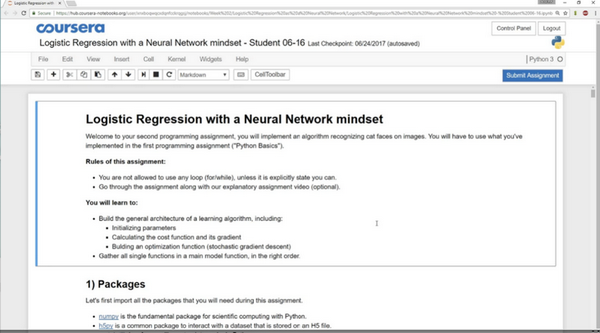

这就是**Jupyter iPython Notebooks**的界面，你可以通过它连接到**Coursera**。让我快速地讲解下它的一些特性。关于它的说明已经被写入这个**Notebook**中。


这里有一些空白区域的代码块，你可以在这里编写代码。有时，你也会看到一些函数块。而关于这些的说明都已经在**iPython Notebook**的文本中。在**iPython Notebook**中，在这些较长的灰色的区域就是代码块。


有时，你会看到代码块中有像这样的开始代码和结束代码。在进行编程练习时，请确保你的代码写在开始代码和结束代码之间。


比如，编写打印输出**Hello World**的代码，然后执行这一代码块（你可以按**shift +enter**来执行这一代码块）。最终，它就会输出我们想要的**Hello World**。

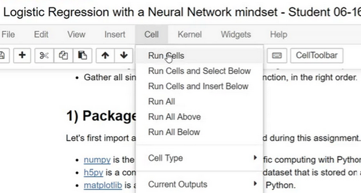

在运行一个单元格**cell**时，你也可以选择运行其中的一块代码区域。通过点击**Cell**菜单的**Run Cells**执行这部分代码。

也许，在你的计算机上，运行**cell**的键盘快捷方式可能并非是**shift enter**。但是，Mac应该和我的个人电脑一样，可以使用**shift + enter**来运行**cell**。


当你正在阅读指南时，如果不小心双击了它，点中的区域就会变成**markdown**语言形式。如果你不小心使其变成了这样的文本框，只要运行下单元格**cell**，就可以回到原来的形式。所以，点击**cell**菜单的**Run Cells**或者使用**shift + enter**，就可以使得它变回原样。


这里还有一些其他的小技巧。比如当你执行上面所使用的代码时，它实际上会使用一个内核在服务器上运行这段代码。如果你正在运行超负荷的进程，或者电脑运行了很长一段时间，或者在运行中出了错，又或者网络连接失败，这里依然有机会让**Kernel**重新工作。你只要点击**Kernel**，选择**Restart**，它会重新运行**Kernel**使程序继续工作。

所以，如果你只是运行相对较小的工作并且才刚刚启动你的**ipad**或笔记本电脑，这种情况应该是不会发生的。但是，如果你看见错误信息，比如**Kernel**已经中断或者其他信息,你可以试着重启**Kernel**。


当我使用**iPython Notebook**时会有多个代码区域块。尽管我并没有在前面的代码块中添加自己的代码，但还是要确保先执行这块代码。因为在这个例子，它导入了**numpy**包并另命名为**np**等，并声明了一些你可能需要的变量。为了能顺利地执行下面的代码，就必须确保先执行上面的代码，即使不要求你去写其他的代码。

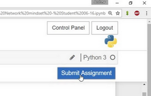

最后，当你完成作业后，可以通过点击右上方蓝色的**Submit Assignment**按钮提交你的作业。

我发现这种交互式的**shell**命令，在**iPython Notebooks**是非常有用的，能使你快速地实现代码并且查看输出结果，便于学习。所以我希望这些练习和**Jupyter iPython Notebooks**会帮助你更快地学习和实践，并且帮助你了解如何去实现这些学习算法。后面一个视频是一个选学视频，它主要是讲解逻辑回归中的代价函数。你可以选择是否观看。不管怎样，都祝愿你能通过这两次编程作业。我会在新一周的课程里等待着你。


### 2.18 （选修）logistic 损失函数的解释（Explanation of logistic regression cost function）


在前面的视频中，我们已经分析了逻辑回归的损失函数表达式，在这节选修视频中，我将给出一个简洁的证明来说明逻辑回归的损失函数为什么是这种形式。


回想一下，在逻辑回归中，需要预测的结果$\hat{y}$,可以表示为$\hat{y}=\sigma(w^{T}x+b)$，$\sigma$是我们熟悉的$S$型函数 $\sigma(z)=\sigma(w^{T}x+b)=\frac{1}{1+e^{-z}}$ 。我们约定 $\hat{y}=p(y=1|x)$ ，即算法的输出$\hat{y}$ 是给定训练样本 $x$ 条件下 $y$ 等于1的概率。换句话说，如果$y=1$，在给定训练样本 $x$ 条件下$y=\hat{y}$；反过来说，如果$y=0$，在给定训练样本$x$条件下 $y$ 等于1减去$\hat{y}(y=1-\hat{y})$，因此，如果 $\hat{y}$ 代表 $y=1$ 的概率，那么$1-\hat{y}$就是 $y=0$的概率。接下来，我们就来分析这两个条件概率公式。


这两个条件概率公式定义形式为 $p(y|x)$并且代表了 $y=0$ 或者 $y=1$ 这两种情况，我们可以将这两个公式合并成一个公式。需要指出的是我们讨论的是二分类问题的损失函数，因此，$y$的取值只能是0或者1。上述的两个条件概率公式可以合并成如下公式：

$p(y|x)={\hat{y}}^{y}{(1-\hat{y})}^{(1-y)}$

接下来我会解释为什么可以合并成这种形式的表达式：$(1-\hat{y})$的$(1-y)$次方这行表达式包含了上面的两个条件概率公式，我来解释一下为什么。


第一种情况，假设 $y=1$，由于$y=1$，那么${(\hat{y})}^{y}=\hat{y}$，因为 $\hat{y}$的1次方等于$\hat{y}$，$1-{(1-\hat{y})}^{(1-y)}$的指数项$(1-y)$等于0，由于任何数的0次方都是1，$\hat{y}$乘以1等于$\hat{y}$。因此当$y=1$时 $p(y|x)=\hat{y}$（图中绿色部分）。

第二种情况，当 $y=0$ 时 $p(y|x)$ 等于多少呢?
假设$y=0$，$\hat{y}$的$y$次方就是 $$\hat{y}$$ 的0次方，任何数的0次方都等于1，因此 $p(y|x)=1×{(1-\hat{y})}^{1-y}$ ，前面假设 $y=0$ 因此$(1-y)$就等于1，因此 $p(y|x)=1×(1-\hat{y})$。因此在这里当$y=0$时，$p(y|x)=1-\hat{y}$。这就是这个公式(第二个公式，图中紫色字体部分)的结果。

因此，刚才的推导表明 $p(y|x)={\hat{y}}^{(y)}{(1-\hat{y})}^{(1-y)}$，就是 $p(y|x)$ 的完整定义。由于 log 函数是严格单调递增的函数，最大化 $log(p(y|x))$ 等价于最大化 $p(y|x)$ 并且地计算 $p(y|x)$ 的 log对数，就是计算 $log({\hat{y}}^{(y)}{(1-\hat{y})}^{(1-y)})$ (其实就是将 $p(y|x)$ 代入)，通过对数函数化简为：

$ylog\hat{y}+(1-y)log(1-\hat{y})$

而这就是我们前面提到的损失函数的负数 $(-L(\hat{y},y))$ ，前面有一个负号的原因是当你训练学习算法时需要算法输出值的概率是最大的（以最大的概率预测这个值），然而在逻辑回归中我们需要最小化损失函数，因此最小化损失函数与最大化条件概率的对数 $log(p(y|x))$ 关联起来了，因此这就是单个训练样本的损失函数表达式。

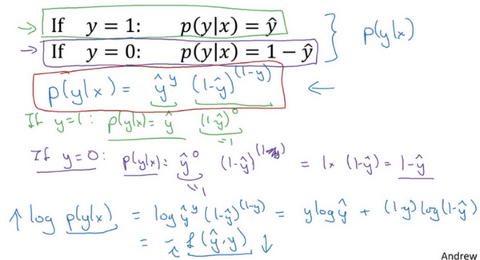

在 $m$个训练样本的整个训练集中又该如何表示呢，让我们一起来探讨一下。

让我们一起来探讨一下，整个训练集中标签的概率，更正式地来写一下。假设所有的训练样本服从同一分布且相互独立，也即独立同分布的，所有这些样本的联合概率就是每个样本概率的乘积:

$P\left(\text{labels  in training set} \right) = \prod_{i =1}^{m}{P(y^{(i)}|x^{(i)})}$。


如果你想做最大似然估计，需要寻找一组参数，使得给定样本的观测值概率最大，但令这个概率最大化等价于令其对数最大化，在等式两边取对数：

$logp\left( \text{labels  in  training set} \right) = log\prod_{i =1}^{m}{P(y^{(i)}|x^{(i)})} = \sum_{i = 1}^{m}{logP(y^{(i)}|x^{(i)})} = \sum_{i =1}^{m}{- L(\hat y^{(i)},y^{(i)})}$

在统计学里面，有一个方法叫做最大似然估计，即求出一组参数，使这个式子取最大值，也就是说，使得这个式子取最大值，$\sum_{i= 1}^{m}{- L(\hat y^{(i)},y^{(i)})}$，可以将负号移到求和符号的外面，$- \sum_{i =1}^{m}{L(\hat y^{(i)},y^{(i)})}$，这样我们就推导出了前面给出的**logistic**回归的成本函数$J(w,b)= \sum_{i = 1}^{m}{L(\hat y^{(i)},y^{\hat( i)})}$。


由于训练模型时，目标是让成本函数最小化，所以我们不是直接用最大似然概率，要去掉这里的负号，最后为了方便，可以对成本函数进行适当的缩放，我们就在前面加一个额外的常数因子$\frac{1}{m}$，即:$J(w,b)= \frac{1}{m}\sum_{i = 1}^{m}{L(\hat y^{(i)},y^{(i)})}$。

总结一下，为了最小化成本函数$J(w,b)$，我们从**logistic**回归模型的最大似然估计的角度出发，假设训练集中的样本都是独立同分布的条件下。尽管这节课是选修性质的，但还是感谢观看本节视频。我希望通过本节课您能更好地明白逻辑回归的损失函数，为什么是那种形式，明白了损失函数的原理，希望您能继续完成课后的练习，前面课程的练习以及本周的测验，在课后的小测验和编程练习中，祝您好运。


