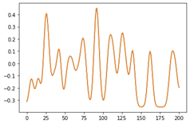

# 20221202
# Step 1 time warp pca
阅读代码，理解数据输入输出和函数工作，twpca是在pca基础上进行时间对齐。
## 实验记录
### 1. 实验错误记录
#### 多级目录创建
```py
if not os.path.isdir(dir):  ##不用加引号，如果是多级目录，只判断最后一级目录是否存在
    os.makedirs(dir)
```
#### scipy.ndimage.gaussian_filter1d
[Python scipy.ndimage.gaussian_filter1d用法及代码示例](https://vimsky.com/examples/usage/python-scipy.ndimage.gaussian_filter1d.html)
```py
scipy.ndimage.gaussian_filter1d(input, sigma, axis=- 1, order=0, output=None, mode='reflect', cval=0.0, truncate=4.0)
"""
参数：
input： array_like
输入数组。

sigma： 标量
高斯核的标准差

axis： 整数，可选
要计算的输入轴。默认值为 -1。

order： 整数，可选
0 阶对应于具有高斯核的卷积。正阶对应于具有高斯导数的卷积。
"""
```

### 2. 变量说明
#### getHandwritingCharacterDefinitions()
* 用法：
```py
from characterDefinitions import getHandwritingCharacterDefinitions
charDef = getHandwritingCharacterDefinitions()
```
* 说明
字符集的读取，包含31个字符，也即26个小写字母和(>,'~?)其中>被用于空格. `charDef`是一个字典，包含的键值为`dict_keys(['charList', 'charListAbbr', 'charLen', 'penStart', 'strToCharIdx', 'kaldiOrder', 'idxToKaldi'])`，它们每一个都是长度为31(32)的列表或数组或字典.
1. charList是字符列表，其中>等非字母符号使用单词表示，例如greaterThan  
2. charListAbbr是字符缩写列表，其中非字母符号直接表示，例如>  
3. charLen是**字符长度**array数组，均为整数，范围区间[68, 132]，理解为笔尖书写该字母时走过的轨迹长度，也可以理解为书写该字母的整体用时，这是手工定义的  
4. penStart是指书写这一字母时笔尖起始位置列表，从[0, 0.25, 0.5, 1.0]中取，值越小起始位置月接近底部线  
5. strToCharIdx是一个字典，他把a,>?b等等字符映射为0到30的index  
6. kaldiOrder是一个字符列表，长度32，称为语料，用于语言模型（例如kaldi），'<ctc>'表示未定义，也即不在这31个字符中的所有字符将映射为'<ctc>'
7. idxToKaldi是一个array数组，长度32，由于语料列表字符顺序不同于charList，故这里也专门定义一个index列表
* 示例:
```py
charDef['charList'][charDef['idxToKaldi'][2]], charDef['kaldiOrder'][2]
# charDef['kaldiOrder'][2]表示语料字符列表的第2个(从0开始)字符, 
# charDef['idxToKaldi'][2]则表示语料字符列表的第2个(从0开始)字符
# 在charList字符列表中的index, 因此两者的含义相同，表示的是同一个字符
```

#### singleLetters.mat
`dat = scipy.io.loadmat(rootDir+'Datasets/'+dataDir+'/singleLetters.mat')`
读取到的数据是一个字典，包含：
1. `'__header__', '__version__', '__globals__'`: 文件头信息
2. `neuralActivityCube_xxx'`系列，包括doNothing以及charList列出的31个字符  
3. `'neuralActivityTimeSeries'`:
4. `'clockTimeSeries'`:
5. `'blockNumsTimeSeries'`: 336932x1的数组(336932为所有实验的时间步数)，第i个元素表示该时间步对应的块号，使用10ms的时间步。这可以用来determine the block during which any time step of data was recorded
6. `'blockList'`: 块号列表[ 5  7  9 11 13 15 17 19 23]
7. `'blockStartDates'`:
8. `'goPeriodOnsetTimeBin'`: 864x1的数组(32x27)，其中第i个元素表示第i次实验在给出go指令的时间步号
9. `'delayPeriodOnsetTimeBin'`:
10. `'characterCues'`: 864x1的数组(32x27)，其中第i个元素表示第i次实验的字符
11. `'meansPerBlock'`: 
12. `'stdAcrossAllData'`:
13. `'arrayGeometryMap'`:v
其中神经活动数据存放在**neuralActivityCube_xxx**中, 他是按字母来分的，例如dat['neuralActivityCube_a']是一个三维的整数矩阵（因此读取后应转为浮点数），表示对字符a进行的27次实验结果情况，每次实验划分为201个时间槽，每个时间槽10ms，一共有192个电极的电信号被记录下来。该矩阵的单个整数元素x表示神经活动的阈值穿过率，也即在对该字母进行一次实验中的一个时间槽内某一电极上的电信号曲线穿过阈值的次数，这就是原始的数据输入。
1. `dat['neuralActivityCube_a'].shape = (27, 201, 192)`, 对于单个字符进行了27次实验(dim=0), 一共201个bin，192个电极  
2. `dat['neuralActivityCube_a'][0][:, 0]`表示在针对字符a进行的27次实验中的第一次实验的第一个电极测得的神经活动时间序列，包含201个时间bin，一个为10ms，每一个bin内的值表示该bin内神经信号曲线穿过阈值的次数。因而这已经是将原始神经信号波形（振荡）曲线处理后得到的输入，并且可以理解为相对值（而不是绝对的神经信号值）。
实验接下来的步骤是：
1. 对原始数据输入（32个3维输入矩阵）进行均值归一化。遍历每一个字符x，对于字符x，先得到27次实验编号，再依据实验编号找到进行字符x实验的块号。这是一个长度为27的列表，其中的元素是整数，表示该字母实验所在块号，可能重复，遍历块号列表，对每一块进行标准化，遍历结束后整体进行归一化。
2. 使用TWPCA对所有的实验进行时间对齐。注意首先需要对均值归一化后的数据进行高斯平滑，然后使用TWPCA进行时间对齐。
3. 最后将对齐后的数据存下来。

### 3. 部分实验结果
#### 进行字母a的实验某一电极在201个bin的变化情况
```py
a_pole_201bin = smoothed_spikes[0][:, 0]
plt.plot(list(range(len(a_pole_201bin))), a_pole_201bin)
plt.show()
```



### 4. 实验方法说明
#### HMMs( hidden Markov Models ) 隐马尔可夫模型
在进行数据训练时，我们无法实时的了解T5正在描画的字符是哪一个，因此需要使用隐马尔可夫模型进行数据标记


