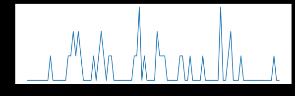

# 20221203 Sun.
# Step 1 HMMs Labeling
使用强制时间对齐的隐马尔可夫模型进行数据标注。
## 实验记录
### 1. 实验过程说明
在其中一些试验中，没有进行实时笔迹解码，这些数据被用来训练RNN解码器。在其他试验中，当T5试图写句子时，RNN解码器是实时运行的，这些数据被用来评估实时解码器的性能。
每次试验开始时都有**5秒的延迟**时间，在此期间，屏幕上一个**红色方块上方**会出现一个句子(或问题)。在延迟期间，T5等待并准备写那个句子(或回答问题)。然后，屏幕中央的**红色方块变成绿色(开始提示)，指示T5立即开始尝试写句子**。当T5确定他写完了，他把头转向右边。我们的系统自动检测到**右转头部，并使用这个信号触发下一次试验**。
有四种类型的句子写作试验:
1. 句子复制(最常见的)。
2. 包含停顿的句子复制。在句子中随机插入符号#，表示T5在遇到这样的字符时稍作停顿(大约1秒钟)。
3. 根据记忆书写短语。在停等阶段，T5需要记住屏幕上的短语（不超过4个单词）。在执行阶段，短语消失，他必须凭记忆将短语书写出来。
4. 自由回答问题。T5需要自己组织语言回答屏幕上出现的问题。许多测试在开始提示后都有很长的停顿，因为T5用这段时间来思考问题的答案，并在开始写之前写下他的回答。

最后三种类型的测试只发生在两个“自由回答”环节，这两个环节的设计是为了评估RNN解码器在自由组合句子上的表现。自由回答会话的训练数据被设计为在T5的书写中创造更多的可变性，试图使RNN解码器对**停顿和书写速度的变化**更健壮。

### 2. 实验错误记录
#### 

#### 


### 3. 变量说明
#### 


### 4. 部分实验结果
#### 单句单电极前100个时间步神经活动记录
```py
import matplotlib.pyplot as plt
st1el1_ = sdt['neuralActivityCube'][0, :100,0]
plt.figure(figsize=(10, 3))
plt.plot(list(range(len(st1el1_))), st1el1_)
plt.show()
```


#### 

### 5. 实验方法说明
#### HMMs( hidden Markov Models ) 隐马尔可夫模型
在进行数据训练时，我们无法实时的了解T5正在描画的字符是哪一个，因此需要使用隐马尔可夫模型进行数据标记.

